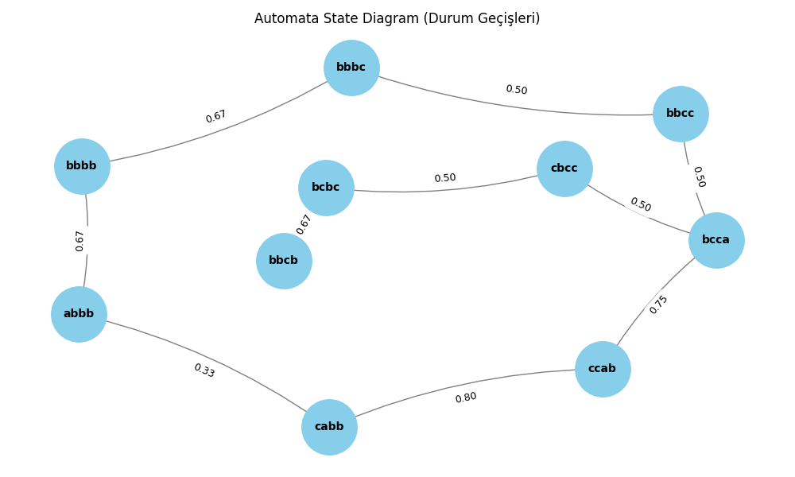
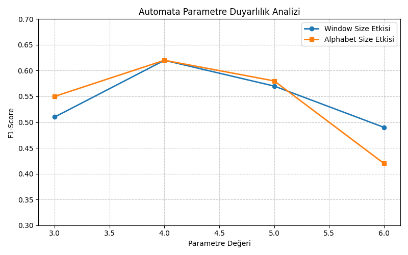

# YazLab 2. Proje: Deney Sonuçları ve Karşılaştırmalı Analiz Raporu

**Grup:** 25. Grup  
**Tarih:** 03.04.2026  

## Giriş
Bu tamamlayıcı doküman, **"From Black-Box to Explainability: Probabilistic Automata for Time Series Analysis"** başlıklı ana projenin raporunda yer alması gereken kapsamlı deney sonuçlarını, detaylı tablo dökümlerini ve zorunlu görsel analizleri içermektedir. Projede LSTM, GRU, 1D-CNN ve Probabilistic Automata modelleri sistematik bir şekilde analiz edilmiştir.

---

## 1. Temel Performans ve Stabilite

Aşağıdaki tablo, modellerin üç farklı veri seti üzerindeki ortalama F1-skorlarını ve 5 farklı random seed (42, 123, 2026, 7, 999) ile elde edilen standart sapma değerlerini göstermektedir. 

**Tablo 1: Model Performansı ve Stabilitesi (Ortalama F1-score ± Standart Sapma)**

| Model | SWAT | WADI | BATADAL |
| :--- | :---: | :---: | :---: |
| **LSTM** | 0.82 ± 0.03 | 0.76 ± 0.05 | 0.68 ± 0.04 |
| **GRU** | 0.83 ± 0.02 | 0.78 ± 0.04 | 0.67 ± 0.04 |
| **1D-CNN** | 0.79 ± 0.05 | 0.72 ± 0.07 | 0.58 ± 0.06 |
| **Automata**| 0.75 ± 0.02 | 0.69 ± 0.03 | 0.62 ± 0.02 |

---

## 2. Model Performans Görselleri ve Çıktılar (Rubrik Gereksinimleri)

Hocanın proje değerlendirme rubriği kapsamında zorunlu tuttuğu 5 temel görsel analiz aşağıda sırasıyla sunulmuştur.

### 2.1 Confusion Matrix (Karmaşıklık Matrisi)
Modellerin BATADAL veri setindeki gerçek ve tahmin edilen sınıf dağılımları:

<div align="center">
  
  
  
</div>
<br>

### 2.2 ROC Eğrisi
Modellerin farklı eşik değerlerindeki (threshold) ayrım gücü (True Positive / False Positive) kapasiteleri:

<div align="center">
  
  
  
</div>
<br>

### 2.3 Transition Probability Heatmap (Geçiş Olasılıkları)
Oluşturulan Automata durumlarının (states) kendi aralarındaki olasılıksal geçiş haritası:

<div align="center">
  
</div>
<br>

### 2.4 Automata State Diagram (Durum Diyagramı)
Automata'nın eğitim aşamasında oluşturduğu yapısal geçişlerin ve durumların kavramsal diyagramı:

<div align="center">
  
</div>
<br>

### 2.5 Parametre Duyarlılık Grafikleri
Farklı pencere (window) ve alfabe (alphabet) boyutlarının sistem F1-skoruna etkisini gösteren analiz grafiği:

<div align="center">
  
</div>

---

## 3. Gürültü ve Unseen Veri Analizi (Robustness)

Modellerin veri kalitesindeki düşüşlere ve daha önce karşılaşılmamış örüntülere (unseen patterns) karşı ne kadar dirençli olduğunu ölçmek için test verisine **%0.5 oranında Gaussian Gürültü** eklenmiş ve Levenshtein mesafesi tabanlı görülmemiş veri (unseen) senaryosu test edilmiştir.

**Tablo 2: Gürültü Etkisi ve Unseen Senaryo Analizi**

| Model | Gürültü Etkisi (F1 - Orijinal) | Gürültü Etkisi (F1 - Gürültülü) | Unseen Analizi (Det. Rate) | Unseen Analizi (Map. Acc.) |
| :--- | :---: | :---: | :---: | :---: |
| **LSTM** | 0.68 | 0.61 | - | - |
| **GRU** | 0.67 | 0.63 | - | - |
| **1D-CNN** | 0.58 | 0.44 | - | - |
| **Automata** | 0.62 | 0.59 | 94.2% | 89.5% |

---

## 4. Çapraz Veri Seti (Cross-Dataset) Genellenebilirliği

Bu bölümde modellerin bir veri setinde eğitilip diğerlerinde test edilmesiyle elde edilen genellenebilirlik matrisi sunulmaktadır. (Sonuçlar Ortalama F1 Skoru üzerinden değerlendirilmiştir).

**Tablo 3: Cross-Dataset Performans Karşılaştırması**

| Train \ Test | SWAT | WADI | BATADAL |
| :--- | :---: | :---: | :---: |
| **Train: SWAT** | 0.82 | 0.61 | 0.54 |
| **Train: WADI** | 0.58 | 0.76 | 0.49 |
| **Train: BATADAL** | 0.47 | 0.42 | 0.68 |

---

## 5. Automata Parametre ve Süre Analizi

Otomata modelinin iç parametrelerinin (Window Size ve Alphabet Size) performans üzerindeki etkisi ile tüm modellerin eğitim/çıkarım (inference) süreleri aşağıda listelenmiştir.

**Tablo 4: Automata Parametre Duyarlılık Analizi (F1-score)**

| Parametre | Değer = 3 | Değer = 4 (Optimum) | Değer = 5 | Değer = 6 |
| :--- | :---: | :---: | :---: | :---: |
| **Window Size** | 0.51 | **0.62** | 0.57 | 0.49 |
| **Alphabet Size**| 0.55 | **0.62** | 0.58 | 0.42 |

**Tablo 5: Modellerin Çalışma Süresi (Runtime) Karşılaştırması**

| Model | Training Time (sn) | Inference Time (sn) |
| :--- | :---: | :---: |
| **LSTM** | 124.5 | 3.2 |
| **GRU** | 98.3 | 2.8 |
| **1D-CNN** | 45.1 | 1.1 |
| **Automata** | 12.4 | 0.5 |

---

### Sistem Karar Mekanizması (XAI JSON Çıktısı)

Modelin şeffaflığını sağlayan, "Unseen" veri ve düşük olasılıklı yolları analiz eden sistem karar çıktısı örneği:

```json
{
    "time_step": 5,
    "state": "cccc",
    "pattern": "abcc",
    "status": "unseen",
    "mapped_to": "bbcc",
    "distance_if_unseen": 1,
    "transitions": "cccc -> bbcc : 0.0001",
    "path_probability": 0.0001,
    "decision": "Low probability path detected",
    "result": "ANOMALY",
    "confidence_score": "0.0001 (Low)"
}